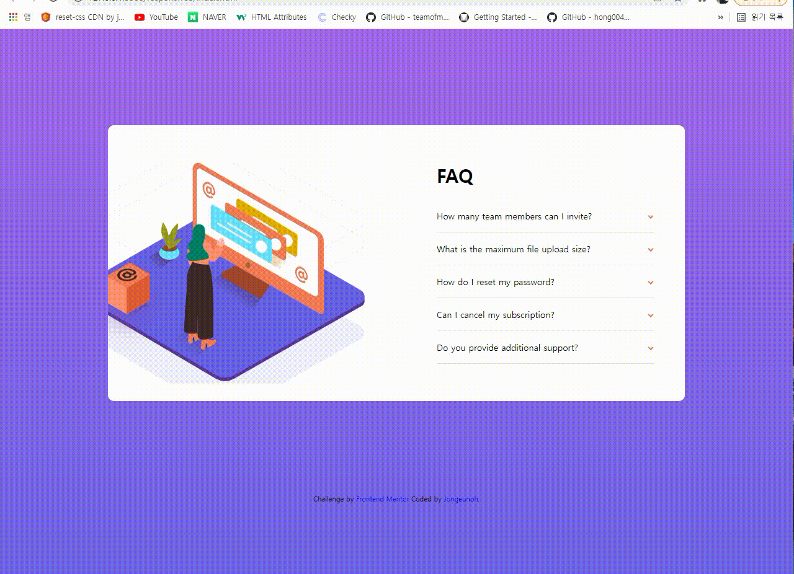
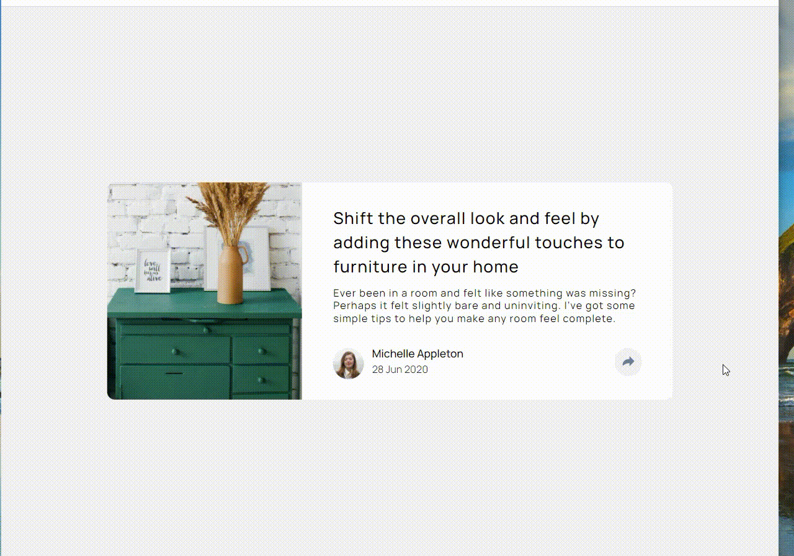

## Responsive1. 헤더 **반응형** 만들기
  **css** 변수 적용해보기

---

 ### 헤더 반응형 완성본
 

 

___

## Responsive2. 유튜브 클론코딩

___

## Responsive3. faq-accordion
 

___

## Responsive4. Article Preview Component
 

